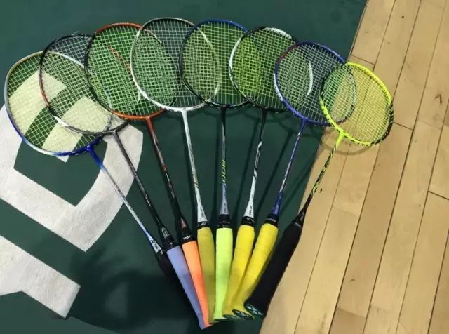

# 打球花费多少

下面来简单分一下，不同羽毛球水平的大概的开销=支出=费用：

* 业余的入门级
  * 总体费用：约`300元/年`
    * 相对固定的装备支出
      * 球拍：150元/支/2年
      * 球线：0
        * 买球拍时自带
      * 球鞋：0
        * 用自己的普通运动鞋
    * 打球频率：1次/月 左右
      * 每次打球的支出
        * 场地费：0
          * 经常无需去场馆打球
          * 虽然找个空地就可以打了
        * 羽毛球：
          * 价格：20元/桶
          * 消耗：1个/场次/人
    * 其他：0
* 业余的中级
  * 总体费用：约`2000元/年`
    * 相对固定的装备支出
      * 球拍：300元/支/1年
        * 球拍数：2支左右
      * 球线：30元/副
        * 换拍线频率：1次/3月
      * 球鞋：200元/双
        * 穿2年/一双鞋
    * 打球频率：4次/月 左右
      * 每次打球的支出
        * 场地费：20元/场次
        * 羽毛球：
          * 价格：50元/桶
          * 消耗：2个/场次/人
    * 其他：0
* 业余的专业级
  * 总体费用：>= `6000元/年`
    * 相对固定的装备支出
      * 球拍：800元/支
        * 球拍数：4支左右
          * 有人拍子超级多，而且还都是好拍子...
            * 
        * 拍子打断后换新买拍子：1支/年 左右
      * 球线：50元/副
        * 换拍线频率：1次/1月
      * 球鞋：500元/双
        * 穿2年/一双鞋
    * 打球频率：10次/月 左右
      * 热恋期：20次/月 左右
      * 每次打球的支出
        * 场地费：30元/场次
        * 羽毛球：
          * 价格：80元/桶
          * 消耗：2个/场次/人
    * 其他
      * 报训练班培训以提高球技：200元/年 左右
      * 其他装备
        * 球包：300元/个
          * 用5年
        * 球服：200元/套
          * 穿2年
          * 可能有多件
        * 护腕：50元/个
          * 用5年
        * 护膝：200元/套
          * 用2年
        * 鞋垫：40元/支 x 2支
          * 作用：减震
          * 用2年
        * 球袜：30元/双
      * 打球受伤的修复费用：几十到几百几千不等
* 专业选手：估计`几万`级别，甚至更高
  * 靠打球吃饭
  * 费用具体不清楚
    * 但可对比去计算
      * 比如随便找出某方面去对比举例
        * 业余的专业水平：1个月 拍线打断 换一次拍线
        * 专业的：平均一周（甚至2，3天）换一次拍线
    * -》算是业余专业水平年均花费的2-10倍
