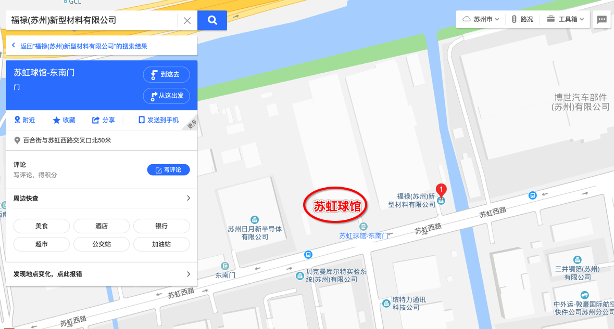
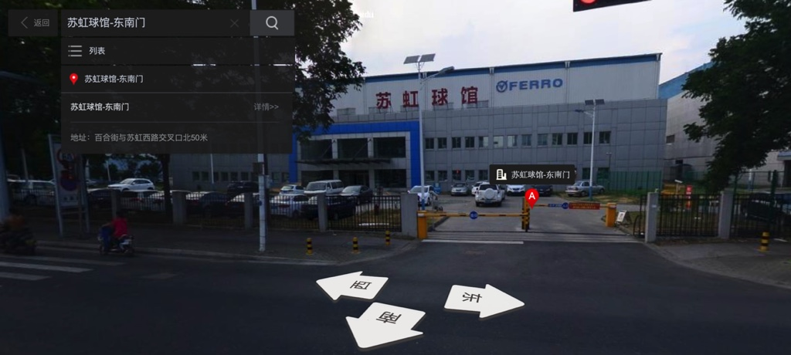
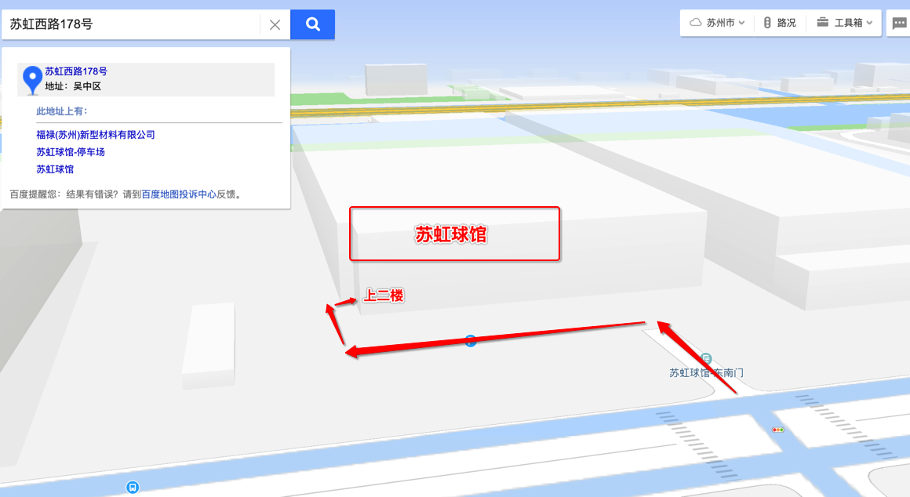

# 苏虹球馆

* 简介：球场是之前一个工厂（之前是福禄(苏州)新型材料有限公司）改造而成的
* 地址：苏州园区百合街与苏虹西路交叉口北50米
* 位置
  * 图片：
    * 
  * 实景图
    * 
  * 如何进去
    * 从南门进去后，左拐到底后右拐边上有个小门，从楼梯上二楼，就到苏虹球馆了
    * 

待确认：2019年，最新情况： 好像已经关闭了？

TODO：

把之前拍的图找到并放过来
