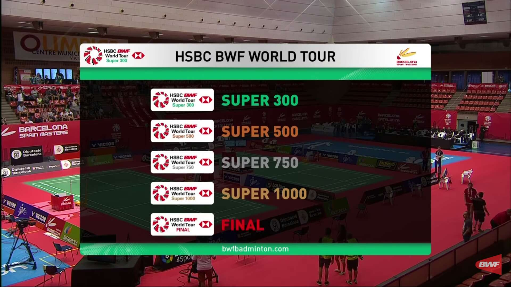
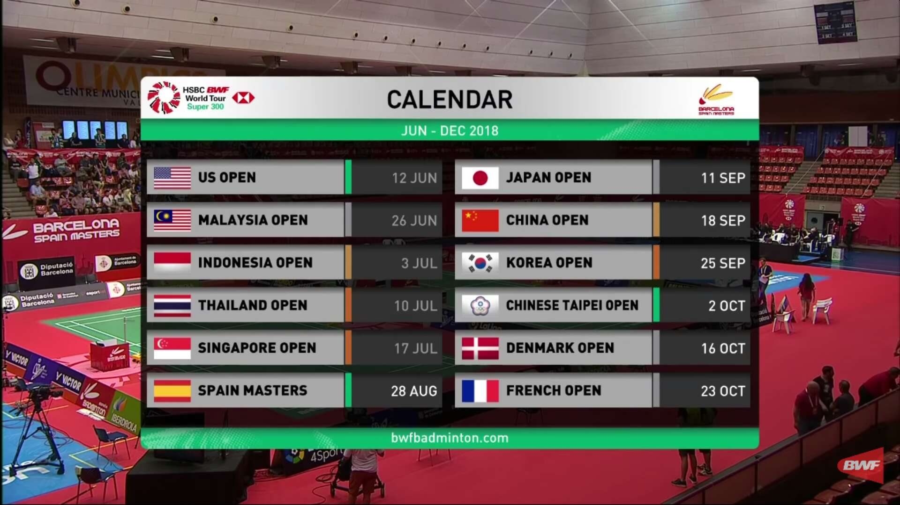
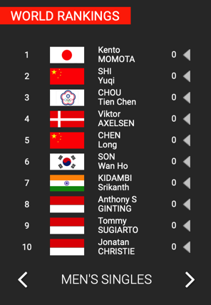
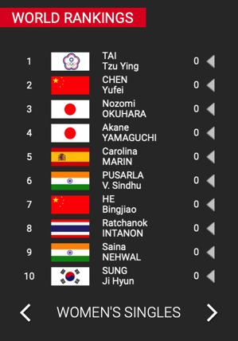
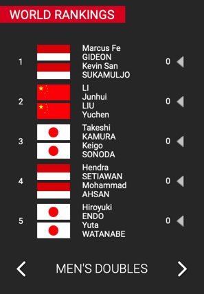
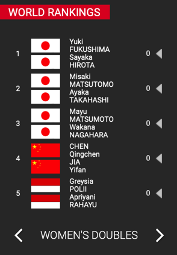
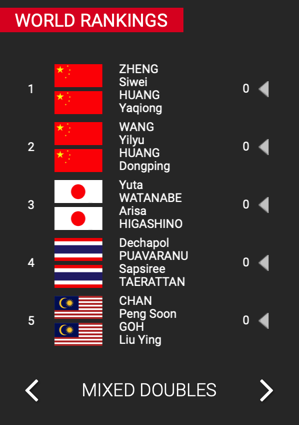

# 专业赛事

羽毛球有很多专业级的赛事，整理如下，供参考。

[【视频推荐】另类看羽球 系列视频 – 在路上](https://www.crifan.com/badminton_battledore_speed/)

## 羽毛球专业组织

### 羽毛球世界联合会

* 羽毛球世界联合会
  * 又称：`国际羽毛球联盟`
  * 简称：`世界羽联`
  * 英文：`BWF`
    * =`Badminton World Federation`
  * 官网：https://bwfbadminton.com
  * Logo
    * 

## 羽毛球赛事

BWF其下举办了一系列等级的赛事：

* Super 300
* Super 500
* Super 750
* Super 1000
* Final

常年被`汇丰银行HSBC`赞助，所以偶尔在youtube直播中会看到这样的界面：

其中还能看到比赛日程播报：

而有不同的专业羽毛球联盟或组织，也有自己的赛事。

常见羽毛球赛事：

* 全英公开赛
* 马来西亚公开赛
* 苏迪曼杯
* 印尼公开赛
* 世界锦标赛
* 丹麦公开赛
* 中国公开赛
* 世界羽联总决赛
  * 就是`BWF`的`Final`

## 世界排名

[BWF的官网](https://bwfbadminton.com)可以看到实时的世界排名。

比如截至20190323的排名：

* 男单
  * 
* 女单
  * 
* 男双
  * 
* 女双
  * 
* 混双
  * 
