# `YouTube`的`BWF`

`BWF`在`youtube`有个频道，其中可以看到：

* 历史比赛录像
* 实时的赛事视频直播

> #### note:: 需要科学上网后才能看`YouTube`视频
> 由于众所众知的原因，想要看`youtube`的网站或app，都需要先能科学上网后才能看。
>
> 如果不会科学上网，可以去参考我另外教程：[科学上网相关知识总结](https://book.crifan.com/books/scientific_network_summary/website/)

同上，也有两种方式去看：

* app
  * （安卓或iPhone等）手机中的app：`YouTube`
* 网站
  * [BadmintonWorld.tv - YouTube](https://www.youtube.com/user/bwf/)

下面分别介绍一下。

## `BWF`的`YouTube`的`官网`

[BadmintonWorld.tv - YouTube](https://www.youtube.com/user/bwf/)

主页效果：

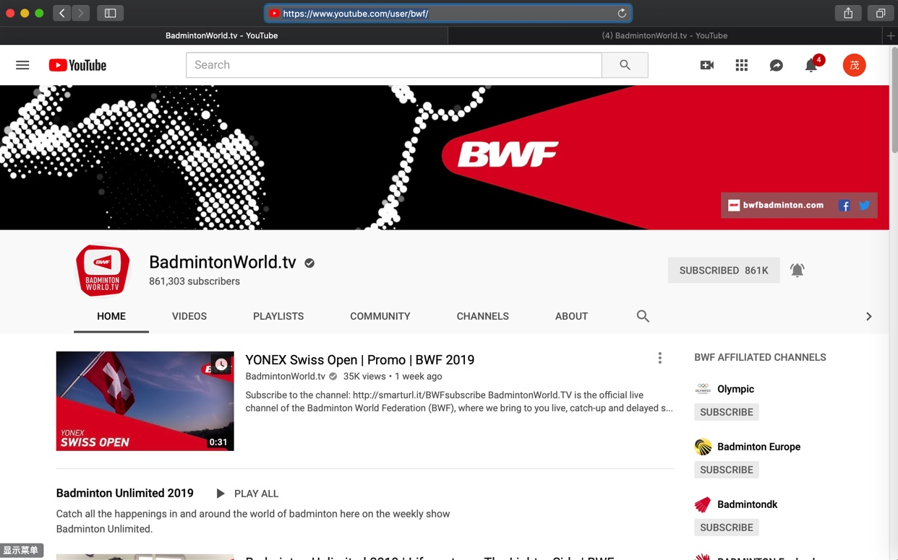

其中`VIDEOS`中有很多历史赛事的视频：

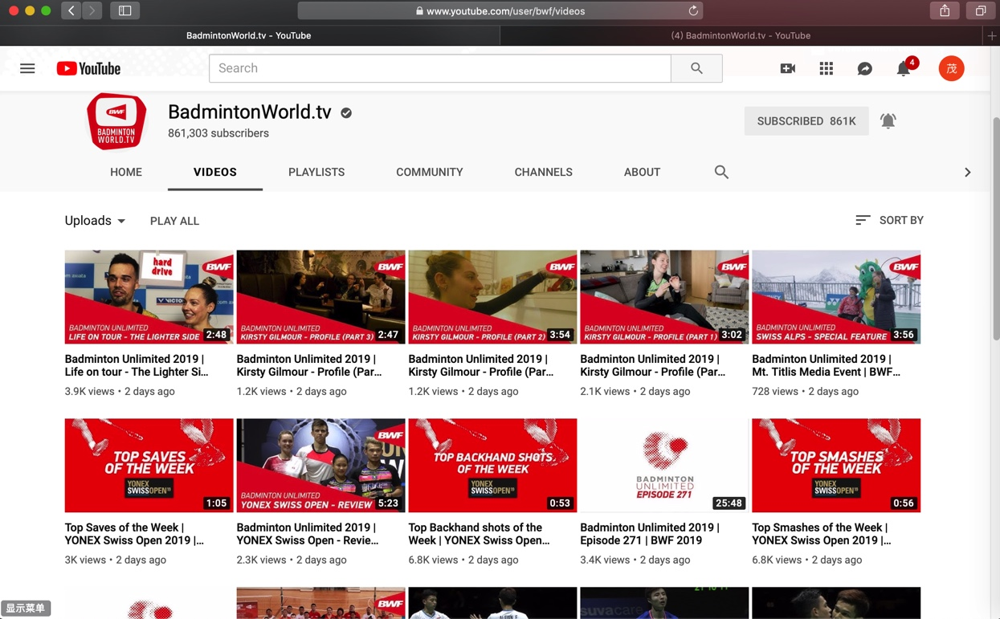

### 实时直播羽毛球比赛

如果遇到了比赛，`YouTube`中也有实时Live直播：

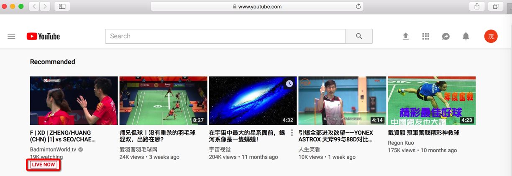

点击进入后：

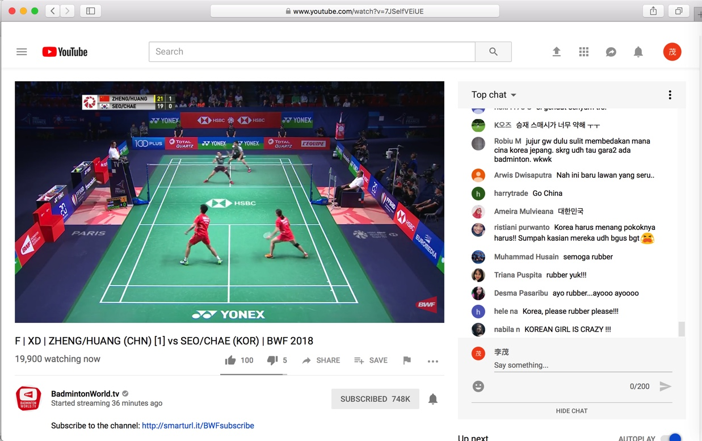

全屏后效果：

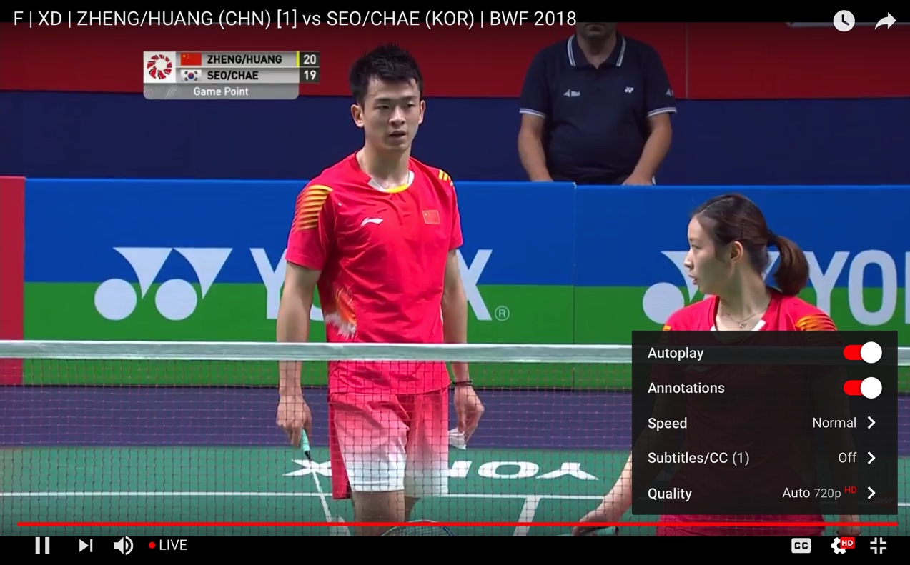

## `BWF`的`YouTube`的`app`

同理，手机中的`YouTube`的app中：

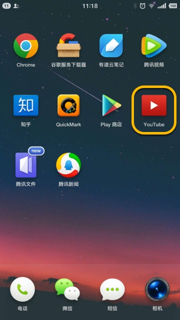

也可以看对应的`BWF`的视频和赛事直播。

比如2018丹麦？的男单决赛 桃田 和 周天成的比赛：

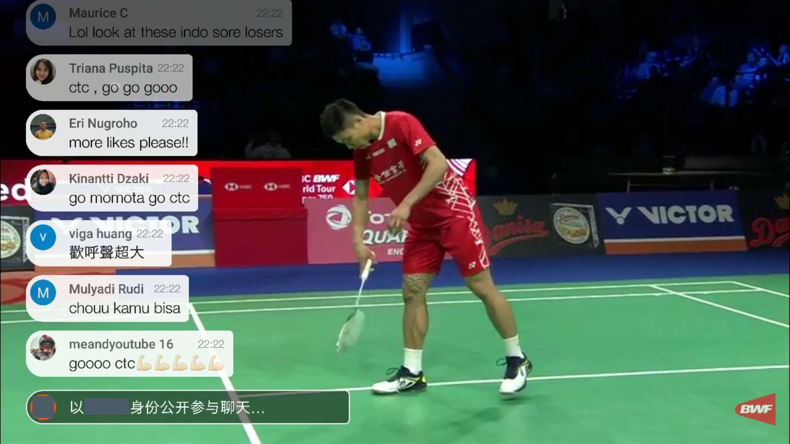

### 如何订阅(关注)`YouTube`中的`BWF`

如果想要在有直播比赛之前，收到BWF的最新比赛的通知，就像这样的邮件通知：

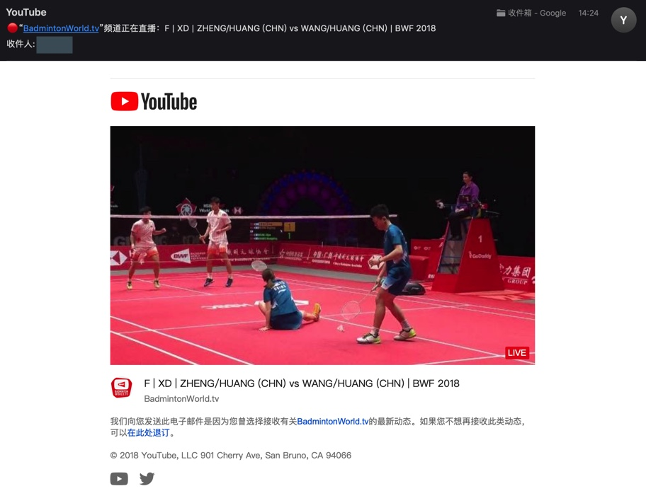

可以去订阅BFW，具体步骤是：

进入任意一个BWF的比赛，在 `BadmintonWorld.tv` 右边点击`订阅`

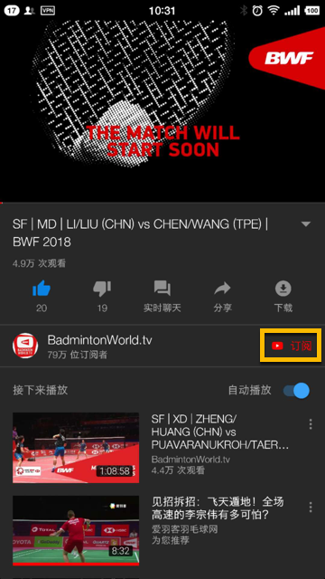

会显示`已订阅`：

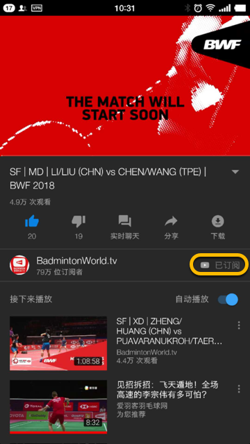

右边会马上出现一个`小闹钟`铃铛，点击后变成`闹钟响`的样子：

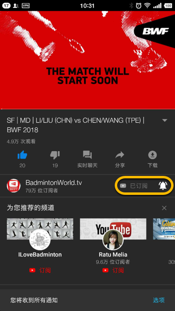

底部会出现提示，点击选项后可以看到 订阅的内容选项：

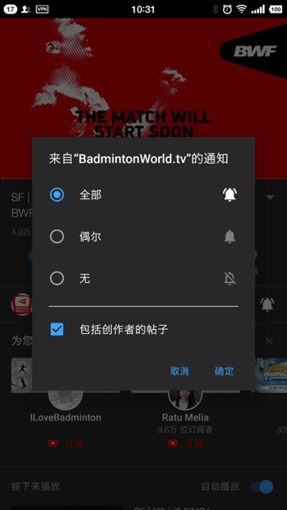

然后再去点击`BadmintonWorld.tv`进入订阅的主页：

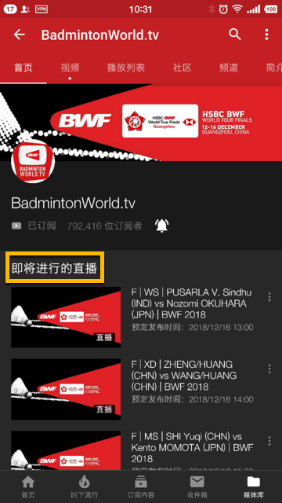

可以看到将要直播的比赛内容，和具体时间都有显示，到时候就可以看比赛直播了。

## `BWF`中比赛标题中字母缩写的含义

如前面的多个比赛视频中的标题中，常常含有一些缩写字母，比如`F|WS`，`F|MD`等字样，其具体含义如下：

* 比赛轮次
  * `F`=`Final`=`决赛`
  * `SF`=`Semi Final`=`半决赛`
* 比赛类型
  * `WS`=`Women Single`=`女单`=`女子单打`
  * `MS`=`Man Single`=`男单`=`男子单打`
  * `WD`=`Women Double`=`女双`=`女子双打`
  * `MD`=`Man Double`=`男单`=`男子单打`
  * `XD`=`Mixed Double`=`混双`=`男女混双`

所以：

* `F|WS`=女单决赛
* `F|MD`=男双决赛
